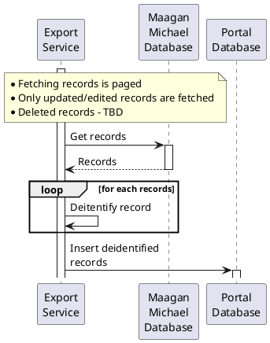

# Data Flow

## Privacy
In order to protect users privacy, data that is retrived from the Kibbuts databases will be deidentified.
Indexed columns content will be replaced with SHA2 384 or 512 bits to allow filtering on a later stage.

The following diagram describes the workflow of exporting data from Maagan Michael database into the external database:

